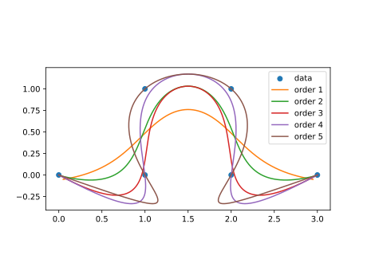

# PolyCurve

## Summary

An algorithm that can fit a polynomial curve to noisy points. It supports any polynomial order:



and an adjustable tightness of fit:


It also supports a curve of any dimensionality.

Performs weighted linear regression around each output point to produce the next point on a curve. The weights are Gaussian weights, the standard deviation σ can be used to control the closeness of the fit.

## Complexity

The code is unoptimised. Each of $M$ output points is produced using a convolution with an $M$-wide kernel and a $2×2$ matrix inverse, resulting in $\text{O}(NM)$ complexity (where $N$ is the number of inputs). $\text{O}(N+M)$ is possible with optimisations.

## Details

For each output point the following computation is performed:

$$ p = x_q(XᵀX)⁻¹XᵀY $$

where the moment matrices $XᵀX$ and $XᵀY$ were both produced as a Gaussian weighted average of moments from the output point's neighbourhood (neighbourhood within the data array).

$X$ has 2 dimensions, a constant 1 and a coordinate on a curve ranging from 0 to 1. For example for 6 output points on the curve:

$$
X = \begin{bmatrix}
1 & 0.0\\
1 & 0.2\\
1 & 0.4\\
1 & 0.6\\
1 & 0.6\\
1 & 1.0\\
\end{bmatrix}
$$

$Y$ has a dimension for each spatial dimension the curve resides in, e.g. 2 for 2D curves. The following Y matrix was used for the plots above:

$$
Y = \begin{bmatrix}
0 & 0\\
1 & 0\\
1 & 1\\
2 & 1\\
2 & 0\\
3 & 0\\
\end{bmatrix}
$$

## Usage

Requirements: `numpy`

```python
def fit_curve(data, density=10, order=1, σ=0.8)
```

`data` is the data the curve will be fitted to, specified the same way the Y matrix is above.

`density` Controls the fineness of the curve by specifying how many output points to produce on the curve for each input point.

`order` is the order of the polynomial. 1 for locally linear, 2 for locally quadratic, etc.

`σ`: controls the tightness of fit as the standard deviation of the Gaussian to use for blurring the moments.