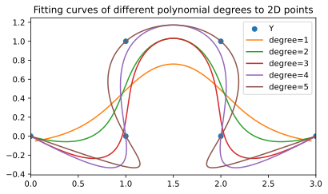

# PolyCurve

## Summary

Fits a polynomial curve to noisy points. Similar to LOWESS. It supports any polynomial `degree` (1→linear, 2→quadratic, etc.):



and an adjustable tightness of fit (shown at 3ʳᵈ degree):


It also supports a curve of any dimension, specified through `Y`.

Performs weighted polynomial regression around each output point to produce a point on a curve. Uses Gaussian weighting, the standard deviation `σ` can be used to control the closeness of fit.

## Details

For each output point $p$ we compute:

$$ p = x_q(X^\mathsf{T}X)⁻¹X^\mathsf{T}Y $$

where the moment matrices $X^\mathsf{T}X$ and $X^\mathsf{T}Y$ were both produced as a Gaussian weighted average of moments from $p$'s neighbourhood within the input data.

The query vector $x_q$ is a vector of $N$ elements used to compute a point of the curve at the given $N$-dimensional coordinates. $x_q=\{1,t\}$ where $t$ is the coordinate along the curve, typically from the $[0,1]$ interval.

$X$ has $N+1$ dimensions for an $N$ᵗʰ degree polynomial curve. For example for 6 input points and a 1ˢᵗ degree curve $X$ is by default:

$$
X = \begin{bmatrix}
1 & 0.0\\
1 & 0.2\\
1 & 0.4\\
1 & 0.6\\
1 & 0.6\\
1 & 1.0\\
\end{bmatrix}
$$

$Y$ has a dimension for each spatial dimension the curve resides in, e.g. 2 for 2D curves. The following Y matrix was used for the plots above:

$$
Y = \begin{bmatrix}
0 & 0\\
1 & 0\\
1 & 1\\
2 & 1\\
2 & 0\\
3 & 0\\
\end{bmatrix}
$$

## Usage

Requirements: `numpy`

```python
def fit_curve(Y, resolution=10, degree=1, σ=0.8)
```

`Y` is the data the curve will be fitted to. It's an M×N array describing M points in N dimensions.

`resolution` controls the resolution of the curve by specifying how many output points to produce on the curve for each input point.

`degree` is the degree of the polynomial. 1 for locally linear, 2 for locally quadratic, etc.

`σ` controls the tightness of fit as the standard deviation of the Gaussian to use for blurring the moments. A higher value will produce a smoother curve.

`X` specifies the spacing of input points. When not specified, the input points are assumed to be evenly spaced.
